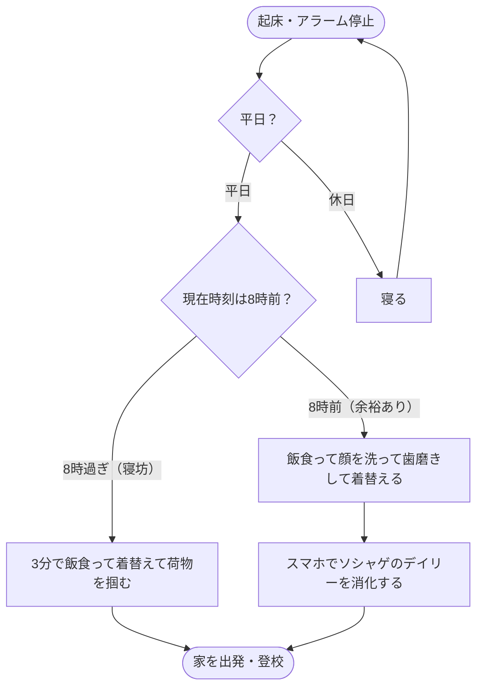

# 私の朝のルーティン

起きてから学校（または二度寝）に向かうまでの意思決定フローチャートです。

```mermaid
flowchart TD
    A([起床・アラーム停止]) --> B{平日？}
    
    B -- 平日 --> C{現在時刻は8時前？}
    B -- 休日 --> D[寝る]
    D --> A
    
    C -- 8時前（余裕あり） --> E[飯食って顔を洗って歯磨きして着替える]
    C -- 8時過ぎ（寝坊） --> F[3分で飯食って着替えて荷物を掴む]
    F --> J
    E --> H[スマホでソシャゲのデイリーを消化する]
    
    H --> J([家を出発・登校])
```